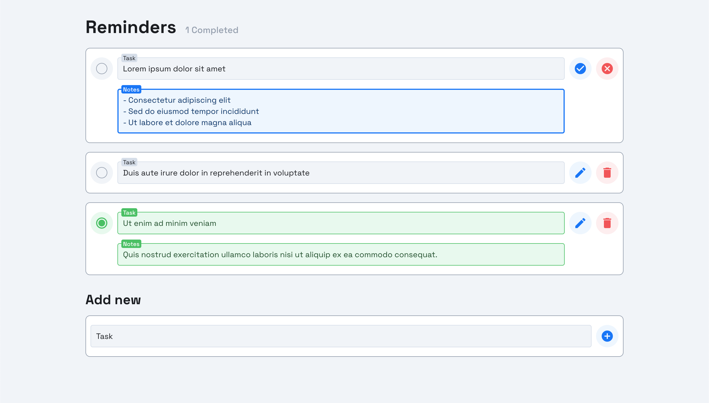

  <h1>Reminders - Task Manager</h1>
  
<strong>Web App</strong> created with <strong>React</strong> and <strong>Redux</strong>

  
<strong>Demo:</strong> <a href="https://mcktrjn.github.io/reminders">mcktrjn.github.io/reminders</a>

  

 

  
 Table of Contents

  <ul>
    <li><a href="#technologies">Technologies</a></li>
    <li><a href="#scripts">Scripts</a></li>
  </ul>

## Technologies

The following technologies and methodologies were used in the project:

## Scripts

In the project directory, you can run:

- `npm start` - Runs the app in the development mode
- `npm test` - Launches the test runner in the interactive watch mode
- `npm run build` - Builds the app for production to the `build` folder
- `npm run eject` - Removes the single build dependency from the project
- `npm run deploy` - Builds and deploys the app to the GitHub Pages
